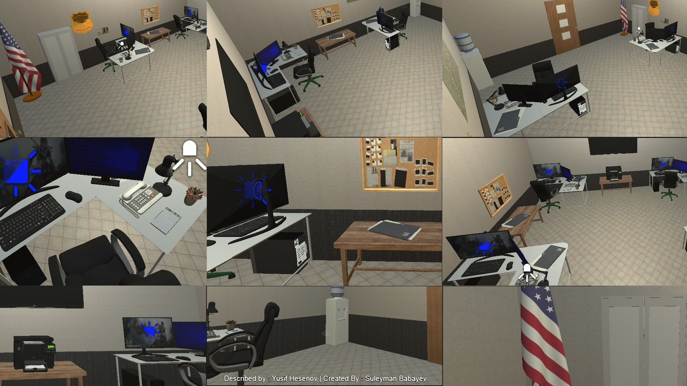

# Devil's Care In Development!
***Story Of The Game***
**In 2016, a small Texas town called Hollow Creek was sealed off after multiple police teams disappeared while investigating strange reports from an abandoned coal mine. Residents reported unnatural human-like figures and terrifying screams at night. The case was officially closed and buried for eight years.
Now, rookie officer Ryan Callahan receives a 911 call from a frightened girl claiming her father is attacking her family. The address: Hollow Creek. Before the call cuts off, a distorted male voice warns him not to come. Ignoring protocol, Ryan drives alone to the quarantined town. As he enters the fog-covered streets, something inhuman jumps into his headlights. He crashes into an old mine building and loses consciousness.**

**Police Dispatcher Room** :

